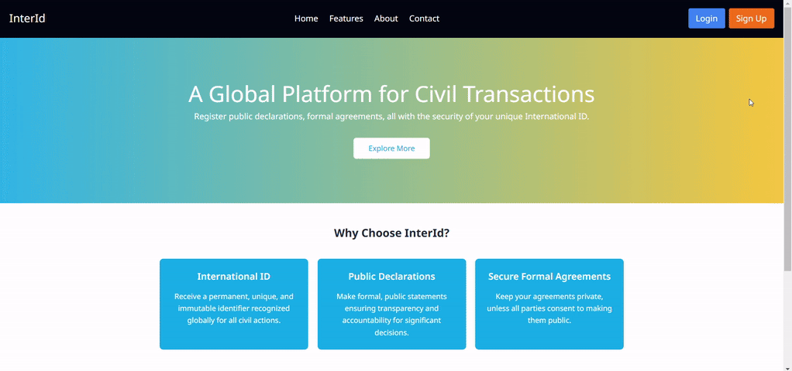

InterId
=======
 *A Network Platform for Civil Transactions*

# Overview
It's all about:
- International ID
- Public Declarations
- Formal Agreements

# Entrance Hall

Built with Tailwind.

# Login via JWT Authentication

# Signup Forms

# Search

# Make a Public Declaration

# Technologies Used
- Frontend: React and Tailwind
- Backend: Django
- Database: SQLite
- Cloud Platform: AWS/EC2

# Highlight: Advanced Python

A magic router decorator was developed, so declaring the endpoints in `urls.py` was not necessary.